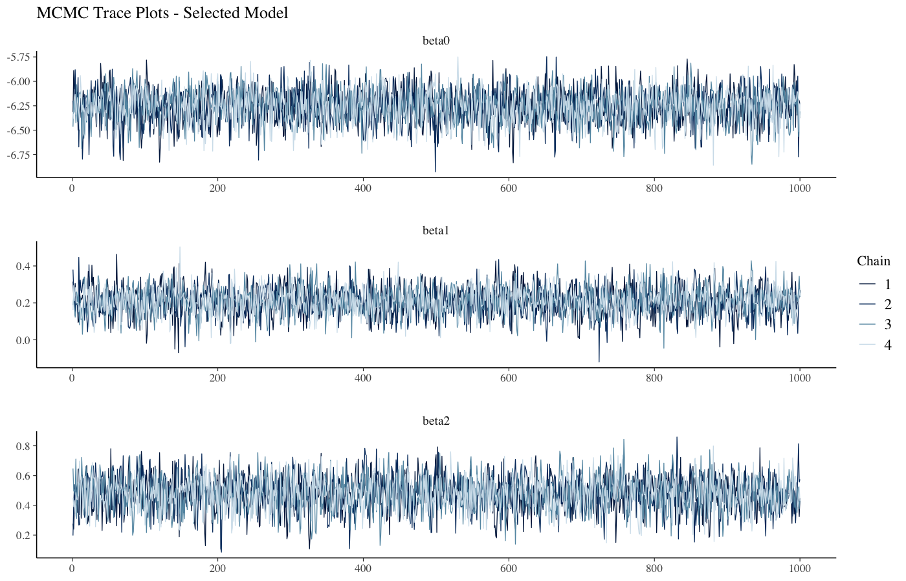
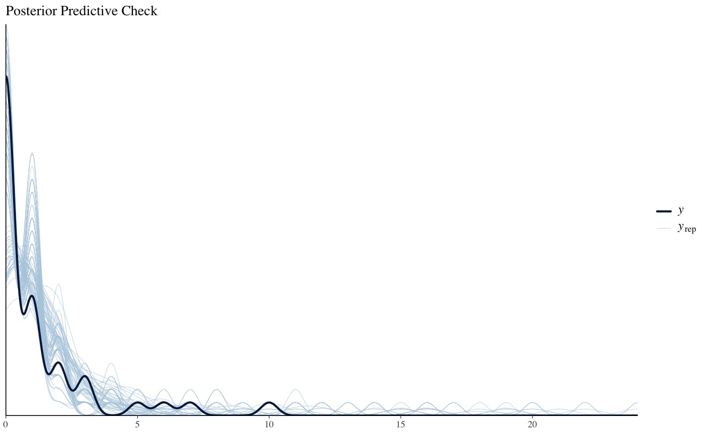
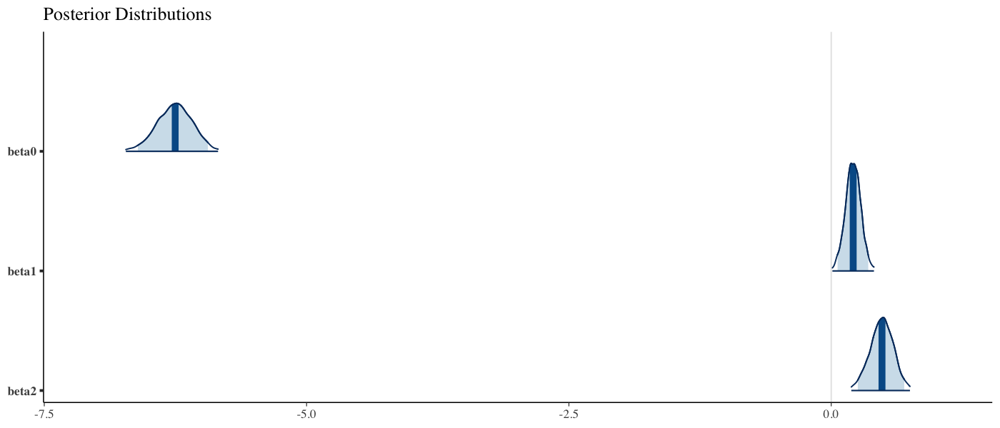

# Bayesian West Nile Virus Risk Modeling

Bayesian analysis of county-level equine West Nile Virus (WNV) incidence using Poisson regression, MCMC inference in Stan, model comparison, and posterior predictive diagnostics.

This repository is a portfolio-oriented refactor of an academic project originally developed for a Computational Statistics course at Sapienza University of Rome. The original project was developed jointly by **Francesco Santarelli and Silvia Alonzo**.

## Research question

Which environmental and epidemiological variables are associated with the number of equine WNV cases across counties in South Carolina, and can avian surveillance variables help explain county-level equine risk?

The analysis uses a Poisson log-linear model with `log(farms)` as an offset, so expected case counts are adjusted for differences in the number of farms across counties.

## What is implemented

- Exploratory analysis of count data and predictor correlations
- Bayesian Poisson regression with a log exposure offset
- Four candidate models:
  1. intercept-only baseline;
  2. bird cases + positive bird rate;
  3. full five-predictor model;
  4. full model with a horseshoe prior for shrinkage / variable selection
- MCMC inference with Stan's NUTS sampler
- Model comparison with PSIS-LOO, WAIC, and approximate DIC
- Convergence checks using R-hat and effective sample size
- Posterior predictive checks
- Posterior coefficient summaries, credible intervals, and incidence rate ratios (IRRs)
- County-level posterior expected case estimates

## Reported results

The two-predictor avian model was retained as the final specification. It had the best reported LOO, WAIC, and DIC values while remaining substantially simpler than the full alternatives.

| Model | Predictors / prior | Delta elpd | WAIC | DIC |
|---|---|---:|---:|---:|
| Baseline | Intercept only | -20.5 | 166.25 | 163.78 |
| **Avian model** | **Bird cases + positive bird rate** | **0.0** | **123.04** | **121.09** |
| Full model | All five predictors | -2.2 | 126.69 | 122.66 |
| Horseshoe | All predictors + horseshoe prior | -1.6 | 125.85 | 122.79 |

The differences between the selected model and the two more complex alternatives were small in LOO terms, so the final choice was based on predictive performance together with parsimony and sampling stability.

### Model diagnostics

The two-predictor avian model achieved the best PSIS-LOO performance, while the full and horseshoe models showed similar predictive performance within uncertainty. The baseline model performed substantially worse.

The reproducible run identified a small number of observations with Pareto-k values above 0.7, so some leave-one-out estimates should be interpreted with caution. The horseshoe model also produced divergent transitions, reinforcing the choice of the simpler avian model as the final specification.

### Selected-model posterior summaries

| Parameter | Posterior mean | 95% credible interval | IRR |
|---|---:|---:|---:|
| Bird cases | 0.21 | [0.06, 0.35] | 1.23 |
| Positive bird rate | 0.48 | [0.25, 0.70] | 1.62 |

For the standardized predictors, the reported interpretation was that a one-standard-deviation increase in bird cases was associated with about a **23% increase** in expected equine cases, while a one-standard-deviation increase in positive bird rate was associated with about a **62% increase**, holding the other predictor constant.

These are **associations from a cross-sectional observational model, not causal effects**.

## Visual diagnostics

### MCMC trace plots



### Posterior predictive check



### Posterior distributions



## Important limitations

The original dataset contains only **46 county-level observations** and is cross-sectional. The response also shows substantial zero mass and overdispersion: the reported mean was 1.17, variance 4.41, and 56.5% of counties had zero equine cases.

For that reason, natural extensions include:

- negative-binomial regression;
- zero-inflated or hurdle models;
- spatial random effects;
- multi-year hierarchical modeling.

These limitations are important when interpreting the model as an explanatory statistical analysis rather than an operational forecasting system.

## Repository structure

```text
.
├── README.md
├── AUTHORS.md
├── .gitignore
├── data/
│   └── README.md
├── R/
│   ├── data_prep.R
│   ├── model_comparison.R
│   └── diagnostics.R
├── stan/
│   ├── model_1_baseline.stan
│   ├── model_2_avian.stan
│   ├── model_3_full.stan
│   └── model_4_horseshoe.stan
├── run_analysis.R
├── figures/
└── results/
    ├── model_comparison.csv
    └── parameter_estimates.csv
```

## Dataset

The original course dataset is **not included** in this repository because redistribution rights are unclear.

The analysis expects a whitespace-delimited text file with the following columns, in order:

`CountyName, State, Bird, Equine, Farms, Area, Population, HumanDensity, PosBirdRate, PosEquineRate`

To run the pipeline, pass the dataset path to `run_analysis.R`:

```bash
Rscript run_analysis.R /path/to/Dataset8.txt
```

## R dependencies

The analysis uses:

- `rstan`
- `bayesplot`
- `loo`
- `coda`
- `ggplot2`
- `gridExtra`
- `dplyr`
- `corrplot`

Package installation is intentionally kept separate from the analysis script.

## Reproducibility note

The original academic analysis used 4 MCMC chains, 4,000 iterations per chain, 2,000 warmup iterations, thinning by 2, and seed 123. Model 4 used a higher `adapt_delta` and `max_treedepth` because of sampling difficulties.

The public version keeps the same model specifications and fitting settings while reorganizing the original single R script into separate data, Stan-model, comparison, and diagnostic components for readability.

## Authors

Original academic project by **Francesco Santarelli** and **Silvia Alonzo**.
